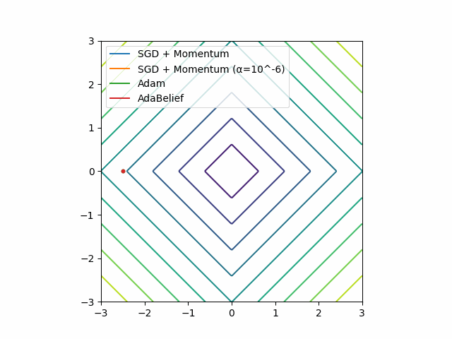

# Toy examples of [AdaBelief Optimizer](https://github.com/juntang-zhuang/Adabelief-Optimizer)
This repository tries to reproduce toy examples (fig.3) in the paper.

## Need help
SGD behaves differently from the figures in the paper.
SGD with learning rate = 10 ^ -3 behaves unstably for Beale function and Rosenbrock function.
I add SGD with learning rate = 10 ^ -6.

## fig.3(a)

## fig.3(b)

## fig.3(c)

## fig.3(d)
**TBD**

## fig.3(e)

## fig.3(f)
**TBD**

## fig.3(g)

## fig.3(h)
**TBD**
